

## Índice

- [Índice](#índice)
- [Funcionalidades](#funcionalidades)
- [Compatibilidade e Requisitos](#compatibilidade-e-requisitos)
- [Instalação](#instalação)
- [Desinstalando](#desinstalando)
- [Reinstalando](#reinstalando)
- [Menu Lateral](#menu-lateral)
- [Configurações](#configurações)
  - [Da loja](#da-loja)
  - [Específicas do Módulo](#específicas-do-módulo)
    - [Aba Quote Shipping](#aba-quote-shipping)
    - [Aba Products Attributes](#aba-products-attributes)
    - [Aba From Settings](#aba-from-settings)
    - [Aba Transportadores](#aba-transportadores)
    - [Aba Configurações de Agência](#aba-configurações-de-agência)
- [Changelog](#changelog)
- [Contribuindo](#contribuindo)

## Funcionalidades

- Disponibilizar aos clientes da loja, cotações com vários fornecedores de frete, de uma maneira simplificada.

- Possui ambiente sandbox para testes

- Seguro para correios

- Aviso de recebimento

- Solicitação de coleta

- Entrega em mãos próprias

- Valor adicional e prazo extra

- Valor de desconto

## Compatibilidade e Requisitos

* Magento 2.4.2 & PHP 7.4
* Magento 2.4.1 & PHP 7.4
* Magento 2.4.0 & PHP 7.4

## Instalação

1. Baixe o arquivo .zip do repositório.

2. Crie as pastas `app/code/MelhorEnvio/Quote`e extraia o .zip para essa pasta.

3. Habilite o módulo com o seguinte comando: 
`bin/magento module:enable MelhorEnvio_Quote`

4. Execute os seguintes comandos:
~~~
bin/magento setup:upgrade && 
bin/magneto setup:di:compile && 
bin/magento setup:static-content:deploy -f && 
bin/magento c:c && bin/magento c:f 
~~~

## Desinstalando

1. Desabilite o módulo com o comando: 
`bin/magento module:disable MelhorEnvio_Quote`

2. Remova os arquivos e a pasta "app/code/MelhorEnvio/Quote"

3. Deletar o registro antigo na tabela setup_module: 
`DELETE FROM setup_module WHERE module = 'MelhorEnvio_Quote'`

4. Execute os seguintes comandos:
~~~
bin/magento setup:upgrade &&
bin/magneto setup:di:compile && 
bin/magento setup:static-content:deploy -f && 
bin/magneto c:c && bin/magento c:f 
~~~

## Reinstalando

1. Deletar o registro antigo na tabela setup_module com o comando SQL:
`DELETE FROM setup_module WHERE module = 'MelhorEnvio_Quote'`

2. Remova a pasta do módulo `app/code/MelhorEnvio/Quote`

3. Baixe o arquivo .zip deste repositório.

4. Crie as pastas `app/code/MelhorEnvio/Quote` e extraia o .zip para essa pasta.

5. Habilite o módulo com o seguinte comando: 
`bin/magento module:enable MelhorEnvio_Quote`

6. Execute os seguintes comandos:
~~~
bin/magento setup:upgrade && 
bin/magneto setup:di:compile && 
bin/magento setup:static-content:deploy -f && 
bin/magneto c:c && bin/magento c:f
~~~

## Menu Lateral

Após realizar a primeira instalação do módulo da Melhor Envio, você irá notar um novo ícone no menu lateral esquerdo com o Label “Melhor Envio”. Ao clicar nele, será aberto um submenu com as opções disponíveis:

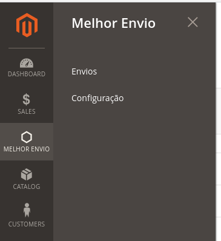

Imagem 1 - Menulateral criado para o módulo

* **Envios**: uma lista com envios, conforme imagem abaixo:

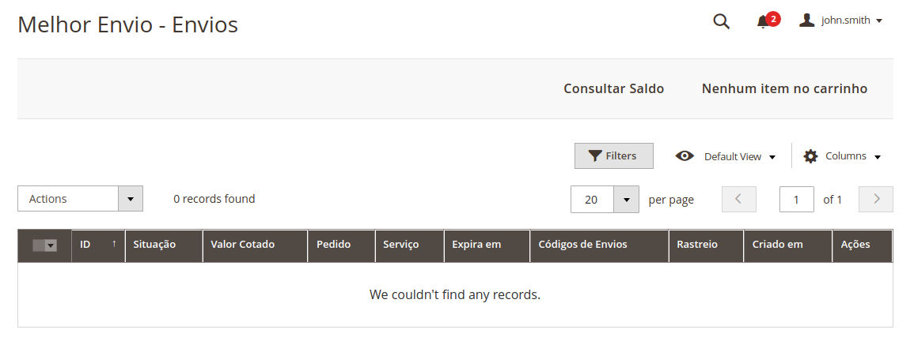

Imagem 2 - Listagem de Envios

* **Configuração**: Um link para as configurações do módulo.

## Configurações

### Da loja

É necessário que as informações da loja sejam preenchidas, para isso vá em Stores > Settings > Configuration > General > General, role até o fim e procure pela seção Store Information. Nela preencha os seguintes campos:

* Store name: nome da loja
* Store Phone Number: número de telefone da loja
* Country: país
* Region/State: estado
* ZIP/Postal Code: cep no formato xxxxxx-xxx
* City: cidade
* Street Address: logradouro e número separados por vírgula
* Street Address 2: nome do seu Bairro

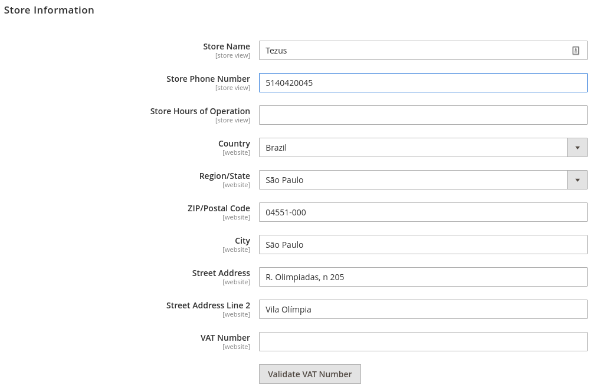

Imagem 3 - Campos de configurações gerais da loja

Ainda no menu de configurações, vá em Sales > Shipping Settings e preencha os seguintes campos:

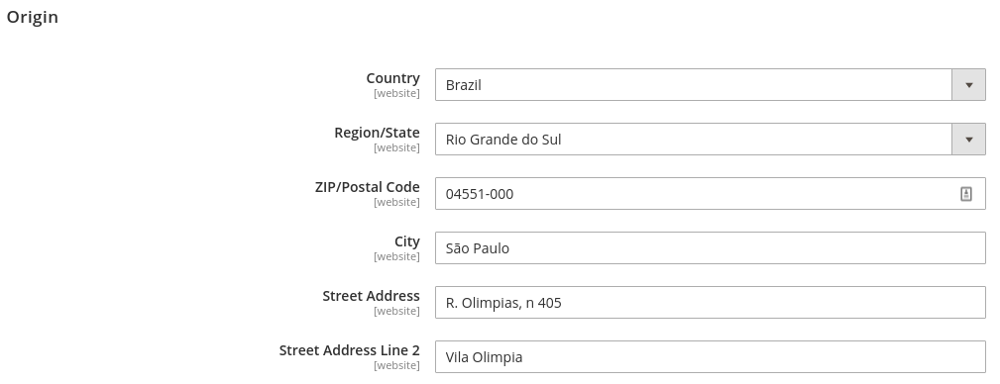

* Country: país
* Region/State: estado
* ZIP/Postal Code: cep no formato xxxxxx-xxx
* City: cidade
* Street Address: logradouro e número separados por vírgula ,

### Específicas do Módulo

As configurações do módulo podem ser acessadas pelo link disponibilizado pelo menu lateral, visto anteriormente, ou, ainda, podem ser acessadas pelo caminho:
Stores > Configurations > Sales (aba do menu) > Delivery Methods > Melhor Envio.
Nesta primeira aba que abrirá, você encontrará as configurações gerais do módulo. Abaixo, seguem detalhados os campos disponíveis para preenchimento e seleção e o que cada um faz:

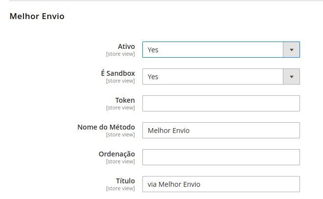

Imagem 4 - Configurações Melhor Envio - parte 1

- **Ativo**: ativa / desativa a cotação dos fretes para os clientes da loja.
- **É Sandox**: ativa / desativa o ambiente sandbox (testes) do módulo. Tanto o ambiente de produção quanto o ambiente de sandbox utilizam o mesmo token de autenticação.
- **Token**: método de autenticação utilizado para realizar as cotações de frete pela api da Melhor Envio que o módulo utiliza. Este token deve ser gerado no próprio painel da Melhor Envio (https://melhorenvio.com.br/cadastre-se).
- **Nome do método**: nome com que o método de envio aparecerá para os clientes da loja.
- **Ordenação**: número de 0 a infinito, que define onde o método será mostrado na lista de métodos de envio. Zero é o menor valor possível, logo, tal método seria o primeiro da lista.
- **Título**: nome do método de entrega.

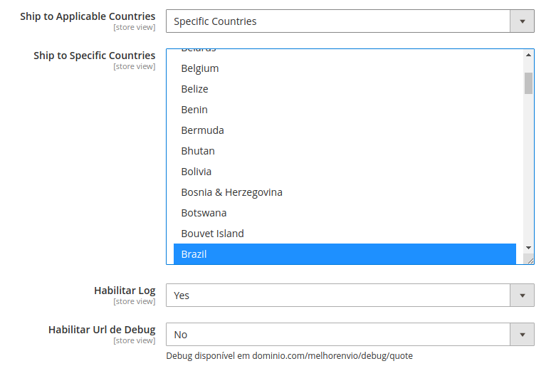

Imagem 5 - Configurações Melhor Envio - parte 2

- **Ship to applicable Countries**: define se o envio pode ser realizado para qualquer país em que o cliente definir no seu endereço de entrega, ou ainda, é possível definir destinos específicos, o que habilita o próximo campo.
- **Ship to Specific Countries**: campo de seleção de países específicos para realizar as cotações de entrega.
- **Habilitar Log**: habilita o log registrar para as transações realizadas pelo módulo com a API.
- **Habilitar Url de Debug**: cria uma url com o domínio da loja, onde é possível ver o log criado.

#### Aba Quote Shipping

Esta aba possui configurações sobre a entrega.

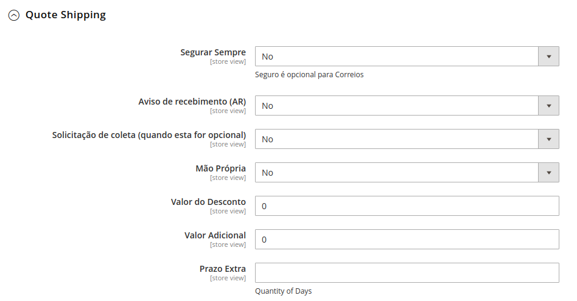

Imagem 6 - Configurações Melhor Envio

- **Segurar sempre**: criar um seguro para o pedido.
- **Aviso de recebimento (AR)**: criar um aviso de recebimento para o cliente, caso o mesmo não possa ser entregue no local.
- **Solicitação de coleta**: define se a entrega deverá ser coletada no local.
- **Mão própria**: define se a entrega deverá acontecer em mãos próprias.
- **Valor do desconto**: valor a ser dado de desconto no frete, em cima do valor fornecido pela api.
- **Valor adicional**: valor adicional a ser cobrado ao valor fornecido pela api.
- **Prazo Extra**: quantidade de dias para adicionar ao prazo fornecido pela api.

#### Aba Products Attributes

Esta aba possui configurações sobre os atributos de produto.

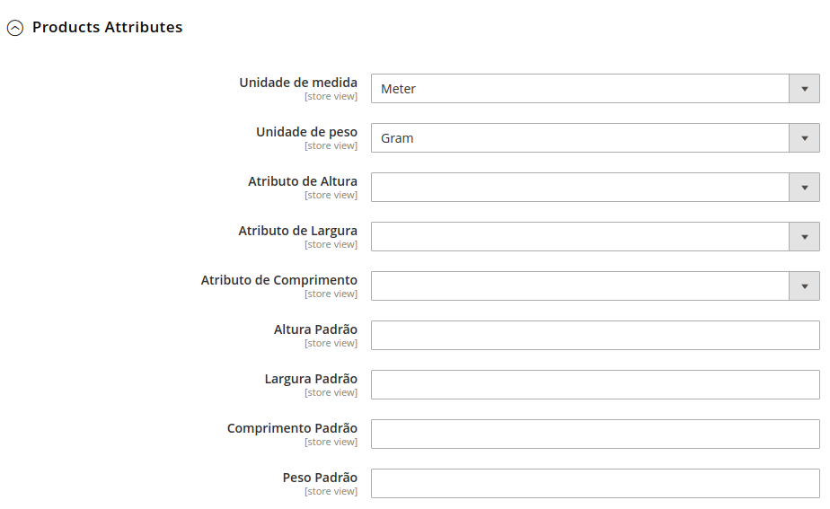

Imagem 7 - Configurações Melhor Envio

- **Unidade de medida**: pode ser metros ou centímetros.
- **Unidade de peso**: gramas ou quilos.
- **Atributo de altura**: mapeamento dos atributos de produtos já existentes na loja, para definir qual o atributo de altura referente ao produto. Caso não exista um previamente na loja, o mesmo deverá ser criado.
- **Atributo de largura**: mapeamento dos atributos de produtos já existentes na loja, para definir qual o atributo de largura referente ao produto. Caso não exista um previamente na loja, o mesmo deverá ser criado.
- **Atributo de comprimento**: mapeamento dos atributos de produtos já existentes na loja, para definir qual o atributo de comprimento referente ao produto. Caso não exista um previamente na loja, o mesmo deverá ser criado.
- **Altura padrão**: altura padrão definida para todos os produtos, caso não exista um atributo de altura na loja, ou ainda, o mesmo não esteja preenchido no produto.
- **Largura padrão**: largura padrão definido para todos os produtos, caso o atributo presente no produto não esteja preenchido.
- **Comprimento padrão**: comprimento padrão definido para todos os produtos, caso o atributo presente no produto não esteja preenchido.
- **Peso padrão**: peso padrão definido para todos os produtos, caso o atributo presente no produto não esteja preenchido.

#### Aba From Settings

Esta aba possui configurações do local de envio e coleta.

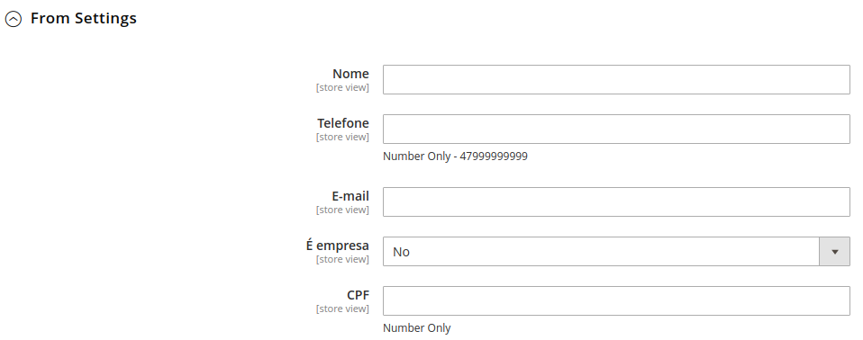

Imagem 8 - Configurações Melhor Envio

* Nome: nome do remetente.
* Telefone: telefone para contato do remetente.
* E-mail: e-mail para contato do remetente.
* CPF: campo para identificação do remetente das postagens, caso seja pessoa física.

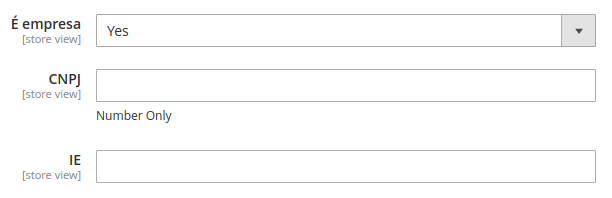

Imagem 9 - Configurações Melhor Envio

* É empresa: Caso marcado como sim, esconde o campo de CPF e abrem os campos de CNPJ e Inscrição estadual.
* CNPJ: número do cnpj do remetente, sem pontuação ou formatação.
* IE: inscrição estadual do remetente, sem pontuação ou formatação.

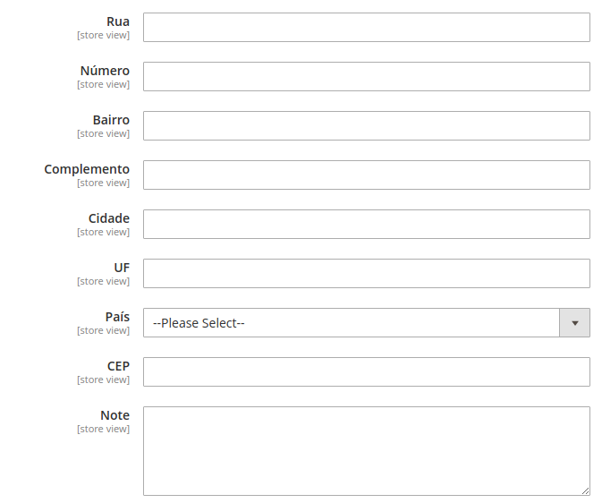

Imagem 10 - Configurações Melhor Envio

* Rua: endereço do remetente
* Número: número do endereço do remetente
* Bairro: do remetente
* Complemento: do endereço do remetente
* Cidade: do remetente
* UF: estado do remetente
* País: do remetente
* CEP: do remetente
* Notas: se houver alguma coisa a ser enviado às transportadoras.

#### Aba Transportadores

Possui configurações para seleção das transportadoras disponíveis para cotação de entrega.

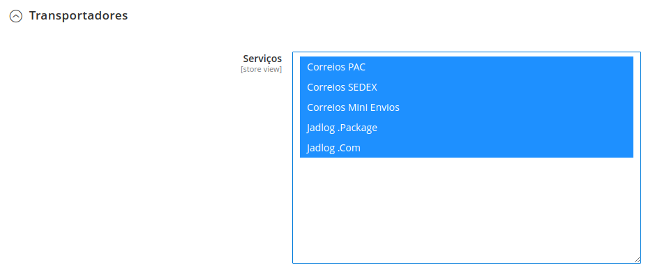

Imagem 11 - Configurações Melhor Envio

#### Aba Configurações de Agência

Possui configurações específicas para seleção das agências da Jadlog.

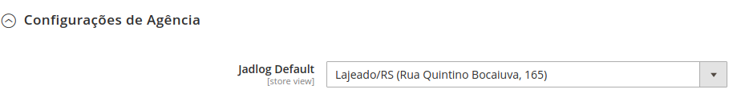

Imagem 12 - Configurações Melhor Envio

## Changelog

Consulte [CHANGELOG](CHANGELOG.md) para mais informações de alterações recentes.

## Contribuindo

Consulte [CONTRIBUTING](CONTRIBUTING.md) para mais detalhes.

